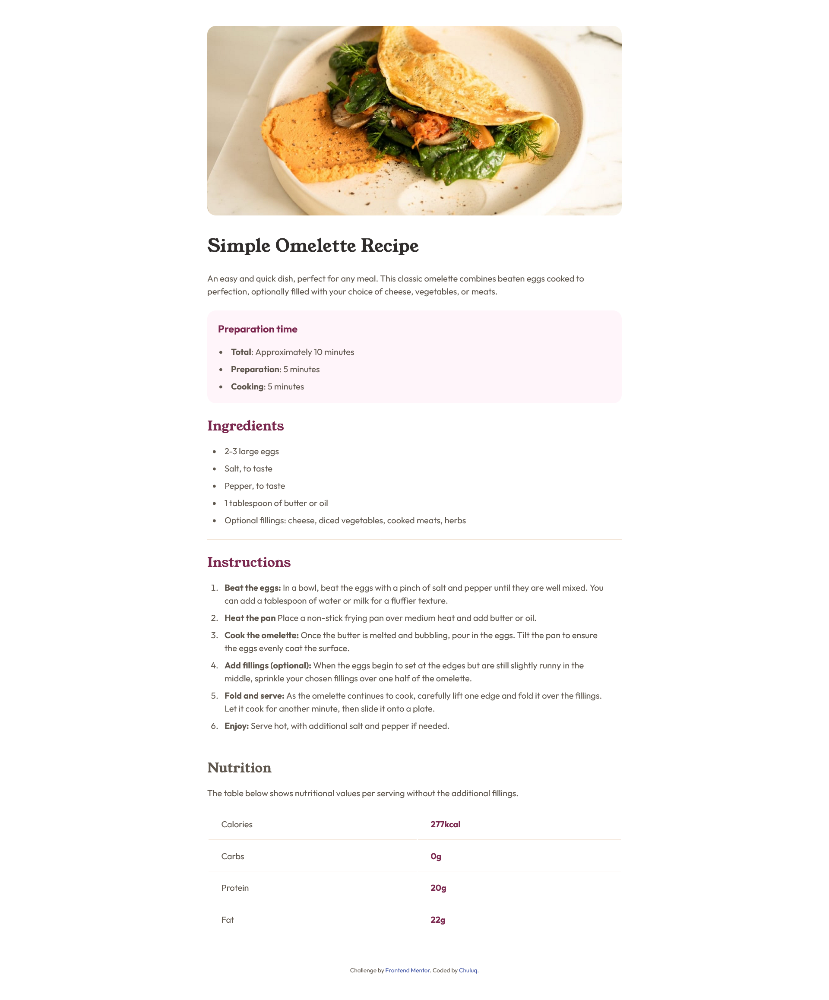

# Frontend Mentor - Recipe page solution

This is a solution to the [Recipe page challenge on Frontend Mentor](https://www.frontendmentor.io/challenges/recipe-page-KiTsR8QQKm). Frontend Mentor challenges help you improve your coding skills by building realistic projects.

## Table of contents

- [Frontend Mentor - Recipe page solution](#frontend-mentor---recipe-page-solution)
  - [Table of contents](#table-of-contents)
  - [Overview](#overview)
    - [Screenshot](#screenshot)
    - [Links](#links)
  - [My process](#my-process)
    - [Built with](#built-with)
    - [What I learned](#what-i-learned)
  - [Author](#author)

**Note: Delete this note and update the table of contents based on what sections you keep.**

## Overview

### Screenshot

### Links

- Solution URL: [Source Code](https://github.com/chuluq/frontendmentor-recipe-page)
- Live Site URL: [Live Preview](https://frontendmentor-recipe-page.vercel.app/)

## My process

### Built with

- Semantic HTML5 markup
- CSS custom properties
- Flexbox
- Mobile-first workflow

### What I learned

Use responsive design through breakpoint and use css variables to use color easily.

## Author

- Website - [Personal Portfolio](https://glowing-glasses.vercel.app/)
- Frontend Mentor - [@chuluq](https://www.frontendmentor.io/profile/chuluq)

**Note: Delete this note and add/remove/edit lines above based on what links you'd like to share.**
